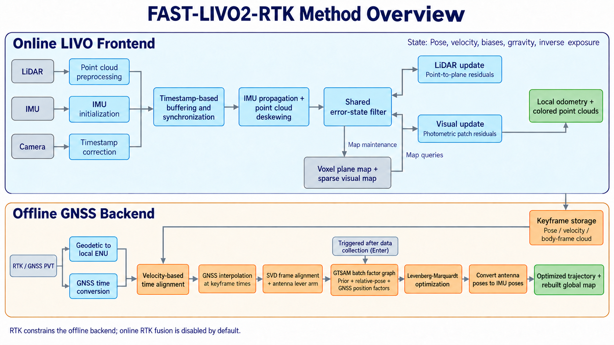
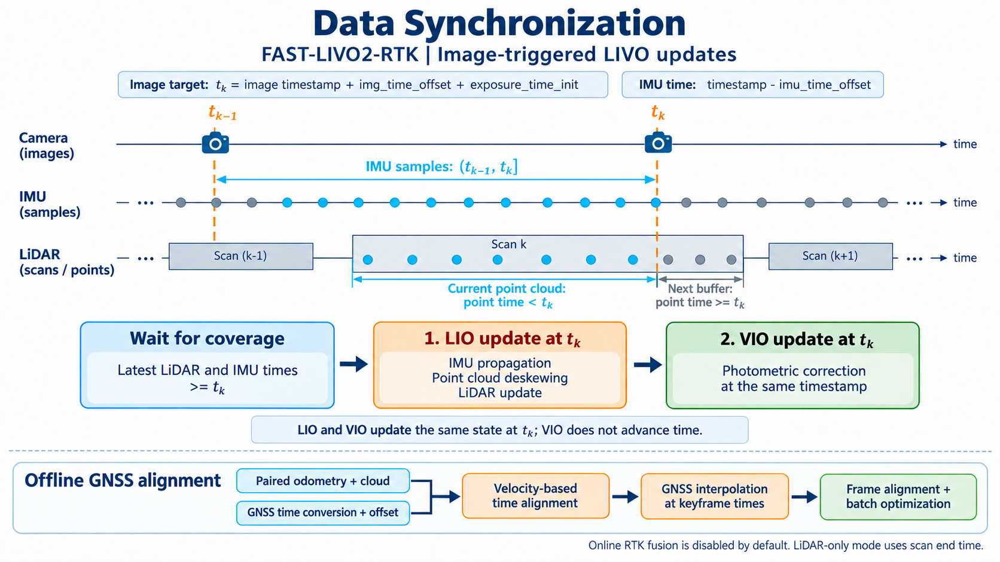

# FAST-LIVO2 Engineering — 里程计、建图与 GNSS 集成

[English](README.md) | **中文**

**源自 [FAST-LIVO2](https://github.com/hku-mars/FAST-LIVO2) 的工程开发分支，提供激光雷达–视觉–惯性里程计与建图，并使用 GNSS/RTK 进行离线轨迹优化。**


这是一个正在进行工程调试的个人项目，重点是传感器接入、时间与坐标一致性、初始化、运行可靠性、配置校验和可重复测试。

本项目不宣称学术贡献或新的 SLAM 方法，也不是 FAST-LIVO2 官方发布版本。激光雷达–视觉–惯性前端源自 FAST-LIVO2。

> **当前状态：** 持续开发与调试中。
> 
## 定位：里程计与建图，附带离线 GNSS 优化

前端估计连续的局部运动轨迹并生成点云地图；后端利用 GNSS 全局位置观测，对采集完成后的轨迹进行对齐和批量优化。

建图可以是 SLAM 的一部分，回环也不是所有 SLAM 定义的必要条件。但当前代码没有实现回环检测和回环约束，因此项目采用 **Odometry & Mapping（里程计与建图）** 作为能力描述，不将其描述为完整的 SLAM 系统。

**GNSS 当前作用于离线后端，在线 RTK 状态校正处于禁用状态。** 离线全局优化结果不等于实时全局定位输出。

## 系统组成

| 传感器 | 作用 |
|---|---|
| LiDAR / 激光雷达 | 几何观测与点云建图 |
| Camera / 相机 | FAST-LIVO2 前端的直接视觉观测 |
| IMU / 惯性测量单元 | 状态传播、重力初始化和运动补偿 |
| GNSS / RTK | 离线对齐和批量优化中的全局位置观测 |

在线前端进行激光雷达–惯性更新和视觉更新。采集完成后，离线后端对齐 GNSS 与前端轨迹，构建 GTSAM 因子图，输出优化轨迹和全局点云。



## 数据同步



LIVO 模式使用校正后的图像时间定义前端更新时刻。激光雷达点和 IMU 样本按该时刻分组，随后在相同状态时刻依次进行 LIO 更新和 VIO 更新。GNSS 在离线后端单独对齐。

- 时间偏移通过 `time_offset` 配置。
- 状态、TF、路径和点云使用测量状态时间，而不是发布时的墙钟时间。
- IMU 高频预测使用校正后的 IMU 时间戳。
- 局部世界坐标使用 `camera_init`，IMU/机体坐标使用 `aft_mapped`。
- GNSS ENU 位置和全局对齐结果使用 `map`，当前没有提供实时全局到局部坐标变换。

图示用于解释概念，实际运行行为以源码和配置为准。两版 README 共用英文图，方便 GitHub 阅读和复用。

## 当前工程改动

| 方向 | 当前工作树中的改动 |
|---|---|
| GNSS / RTK | 观测校验、精度到方差转换、缺测间隔检查、天线偏移处理和后端生命周期修复 |
| 视觉处理 | 投影与小块边界检查、图像校验、鲁棒残差权重、低纹理拒绝及状态/协方差更新保护 |
| IMU | 传播时间显式初始化、重置清理、静止陀螺零偏初始化和非法时间区间拒绝 |
| 输出接口 | 测量时间戳、机体点云坐标标签和机体坐标系速度 |
| 配置 | 启动时检查外参、旋转矩阵、噪声、预处理、视觉参数和地图层数 |
| 验证 | CTest、Debug/Release 辅助测试 CI 和输出数据包契约检查工具 |

这些是等待完整集成验证的实现改动，不是性能或精度指标声明。

详细记录见 [RTK 修改说明](RTK_FIXES.md)、[视觉修改说明](VISUAL_FIXES.md) 和 [P0 工程修改说明](P0_FIXES.md)。RTK 与视觉记录描述此前阶段，P0 记录后续 IMU 修改。

## 依赖与编译

项目使用 **ROS1 catkin / C++17**，完整的已验证环境矩阵仍在建立中。

| 依赖 | 说明 |
|---|---|
| CMake | 3.10 或更新版本 |
| ROS1 / catkin | ROS C++、TF、image transport、CV bridge、PCL conversions 和 message filters |
| PCL、Eigen、OpenCV | 继承版本的基线为 PCL ≥ 1.8、Eigen ≥ 3.3.4、OpenCV ≥ 4.2 |
| OpenMP | 估计器计时与并行代码需要 |
| Sophus | 旧版非模板接口；继承安装配置使用提交 `a621ff` |
| [rpg_vikit](https://github.com/xuankuzcr/rpg_vikit) | 相机模型与工具 |
| [livox_ros_driver](https://github.com/Livox-SDK/livox_ros_driver) | ROS1 Livox 消息定义 |
| [gnss_comm](https://github.com/HKUST-Aerial-Robotics/gnss_comm) | GNSS PVT 消息 |
| [GTSAM](https://github.com/borglab/gtsam) | 离线因子图优化 |
| [GeographicLib](https://geographiclib.sourceforge.io/) | 地理坐标到 ENU 的转换 |

将本仓库和 ROS 包依赖放入 catkin 工作空间，安装其余原生库并加载 ROS 环境，然后执行：

```bash
cd /absolute/catkin_ws
catkin_make -DCMAKE_BUILD_TYPE=Debug -DCATKIN_ENABLE_TESTING=ON -DBUILD_TESTING=ON
source devel/setup.bash
```

正确性检查通过后，再用 Release 进行性能测量。每次验证应记录依赖提交版本和编译器版本。依赖锁定与完整可重复构建容器仍是后续任务。

## 配置

继承示例包括 `launch/HH.launch` 配合 `config/HH-LVGO.yaml`，以及 `launch/AGV.launch` 配合 `config/AGV-LVGO.yaml`。请使用符合实际相机和传感器安装关系的标定文件。

| 配置组 | 用途 |
|---|---|
| `common` | 输入话题和前端模式 |
| `extrin_calib` | LiDAR–IMU、LiDAR–相机外参 |
| `time_offset` | 传感器时间校正 |
| `imu`、`lio`、`vio` | 估计器设置 |
| `gps` | GNSS 话题、天线偏移、时间偏移和后端开关 |
| `opt` | 离线数据加载、因子方差和 GNSS 间隔限制 |
| `pcd_save`、`publish` | 保存和可视化设置 |

`gps/debug_mode` 用于前端调试数据记录；`opt/load_data` 用于从调试记录加载离线数据。旧别名 `opt/debug_mode` 已弃用，配置冲突会使启动失败。

设置 `common/img_en: 0` 可使用激光雷达–惯性模式，不再需要相机模型。IMU 初始化假设传感器静止。

## 使用 ROS bag 运行

数据包必须包含配置中启用的传感器，并使用匹配标定。对于 HH 兼容数据，在分别加载 ROS 和工作空间环境的终端执行：

```bash
# 终端 1
roscore
```

```bash
# 终端 2
rosparam set /use_sim_time true
roslaunch fast_livo HH.launch rviz:=false outputfilepath:=/absolute/new_run/output
```

```bash
# 终端 3
rosbag play --clock /absolute/input.bag
```

播放结束后，在 launch 终端按 **Enter** 触发离线优化。后端等待关键帧流空闲后冻结采集数据，请保持程序运行到优化完成。

每次运行使用新的输出目录。部分继承的前端日志和 PCD/COLMAP 资源仍使用源码目录路径，输出目录处理尚未统一。

## 输出

| 话题 / 目录 | 内容 |
|---|---|
| `/odometry/fast_livo2` | 局部前端里程计 |
| `/synced_cloud` | 按时间戳与里程计配对的机体坐标点云 |
| `/cloud_registered` | 局部世界坐标下的注册点云 |
| `/aft_mapped_to_init` | 局部里程计与对应 TF |
| `/path` | 局部轨迹可视化 |
| `/LIVO2/imu_propagate` | 可选的 IMU 高频预测 |
| `outputfilepath/TUM/` | 后端轨迹导出 |
| `outputfilepath/vel/` | 后端速度导出 |
| `outputfilepath/global_pcd/` | 全局点云导出 |
| `outputfilepath/debug/` | 开启记录时的调试数据 |

后端文件依赖成功的对齐和优化，全局结果属于离线输出。

## 测试与 CI

不依赖 ROS 的 C++ 辅助测试：

```bash
cmake -S . -B build-utils -DFAST_LIVO_UTILS_ONLY=ON -DCMAKE_BUILD_TYPE=Debug
cmake --build build-utils --parallel 2
cd build-utils
ctest --output-on-failure
```

完整 ROS 构建与 CTest：

```bash
bash /absolute/path/to/this_repo/scripts/verify_p0.sh /absolute/catkin_ws
```

回放时录制 `/odometry/fast_livo2` 与 `/synced_cloud`，正常停止录制后执行：

```bash
python3 scripts/check_replay.py /absolute/output-check.bag
```

工具检查里程计有限值、四元数归一化、坐标标签、时间戳不回退及点云/里程计时间配对。它不测量轨迹精度，也不能证明点云几何坐标正确。

GitHub Actions 运行 Debug/Release C++ 辅助测试和 Python 检查工具测试，目前不包含完整 ROS 估计器构建或数据集回放，也没有部署流水线。

**已验证：** GitHub Actions 中的 C++ 辅助测试和 Python 测试已通过，本地静态一致性检查也通过。完整 ROS 编译、依赖实际估计器的 IMU 集成测试及真实数据回放仍待验证。

## 工程路线

- 在明确环境中完成 ROS 编译和回归回放。
- 限制传感器队列、轨迹历史和点云内存。
- 增加超时诊断、受控降级与恢复。
- 用明确的会话接口替代终端输入触发优化。
- 改造数据记录与地图导出，支持异步执行、失败报告和恢复。
- 分离同步、估计、存储、ROS 适配和离线优化职责。


## 来源、作者与许可证

**工程维护者及本地修改作者：** shida <shida.86@outlook.com>。

保留原作者声明和第三方版权头，并在本项目源码中增加工程分支维护署名。

仓库包含 [GNU GPL 第 2 版许可证文本](LICENSE)。第三方组件保留各自的许可证与声明。

